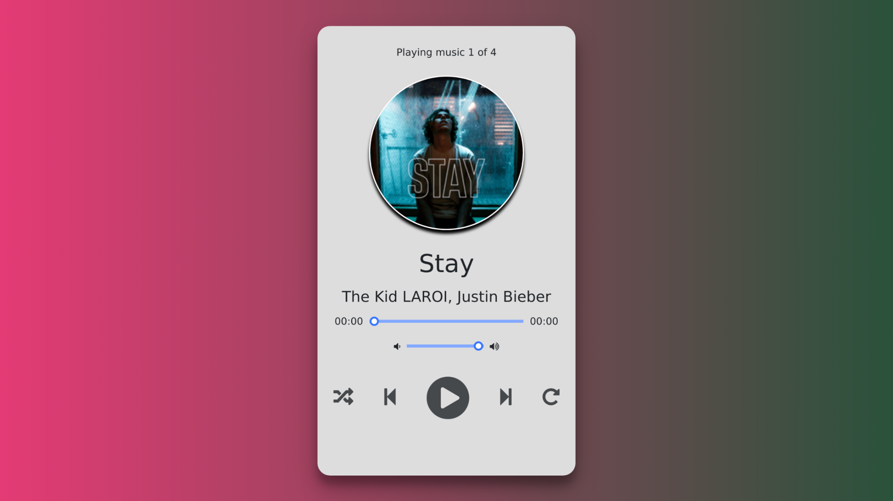

# Music Player

This is a simple music player built using HTML, CSS, and JavaScript without the use of a database. The purpose of this project is to provide a user-friendly interface to play and manage music tracks without the need for a backend database.

## Table of Contents

* Installation
* Usage
* Features
* Contributing
* License

## Installation

To use this project, simply clone the repository to your local machine using the following command:

git clone : `https://github.com/Karthik-beta/Music-Player.git`

Then, open the project folder and open the index.html file in your web browser.

## Usage

The music player is already loaded with four tracks, which can be played using the play, pause, previous, and next buttons. The player also displays the current track name and artist name.

The project includes a playlist feature that allows you to add or remove tracks from the playlist. However, please note that the playlist is pre-loaded with four tracks and cannot be modified by the user. To add or remove tracks, you must change the music files in the project's music folder.

To add a track, simply add the music file to the music folder and it will be automatically added to the playlist. To remove a track, simply delete the music file from the music folder and it will be automatically removed from the playlist.

Please note that any changes made to the music files in the music folder will require changes to be made to the JavaScript code that loads the tracks.

## Features

* Play, pause, previous, and next buttons for music tracks.
* Display of track name and artist name.
Playlist feature to add or remove tracks (by modifying the music files in the music folder).
* Responsive design for mobile and desktop devices.

## Contributing

Contributions to this project are welcome. To contribute, please fork the repository, make your changes, and create a pull request.

## License

This project is licensed under the MIT License. See the LICENSE file for more information.
